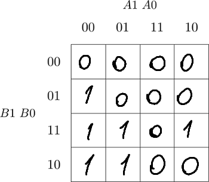
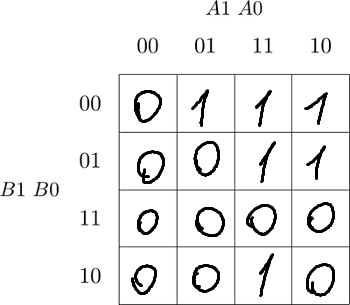
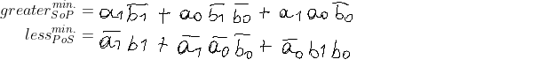

# Lab 2: Lev Meshores

### 2-bit comparator

1. Karnaugh maps for other two functions:

   Greater than:

   

   Less than:

   

2. Equations of simplified SoP (Sum of the Products) form of the "greater than" function and simplified PoS (Product of the Sums) form of the "less than" function.

   

### 4-bit comparator

1. Listing of VHDL stimulus process from testbench file (`testbench.vhd`) with at least one assert (use BCD codes of your student ID digits as input combinations). Always use syntax highlighting, meaningful comments, and follow VHDL guidelines:

   Last two digits of my student ID: **xxxx??**

```vhdl
 p_stimulus : process
    begin
        -- Report a note at the beginning of stimulus process
        report "Stimulus process started" severity note;

        -- First test case
        s_b <= "1001";        -- Such as "0101" if ID = xxxx56
        s_a <= "0110";        -- Such as "0110" if ID = xxxx56
        wait for 100 ns;
        -- Expected output
        assert ((s_B_greater_A = '0') and
                (s_B_equals_A  = '0') and
                (s_B_less_A    = '1'))
        -- If false, then report an error
        report "vrong input" severity error;

        -- Report a note at the end of stimulus process
        report "Stimulus process finished" severity note;
        wait;
    end process p_stimulus;

```

2. Text console screenshot during your simulation, including reports.

   ```
   [2022-03-01 17:22:22 EST] ghdl -i design.vhd testbench.vhd  && ghdl -m  tb_comparator_4bit && ghdl -r  tb_comparator_4bit   --vcd=dump.vcd && sed -i 's/^U/X/g; s/^-/X/g; s/^H/1/g; s/^L/0/g' dump.vcd 
analyze design.vhd
analyze testbench.vhd
elaborate tb_comparator_4bit
testbench.vhd:51:9:@0ms:(report note): Stimulus process started
testbench.vhd:65:9:@100ns:(report note): Stimulus process finished
Finding VCD file...
./dump.vcd
[2022-03-01 17:22:23 EST] Opening EPWave...
Done
   ```

3. Link to your public EDA Playground example:

   [https://www.edaplayground.com/x/6Yb_](https://www.edaplayground.com/x/6Yb_)